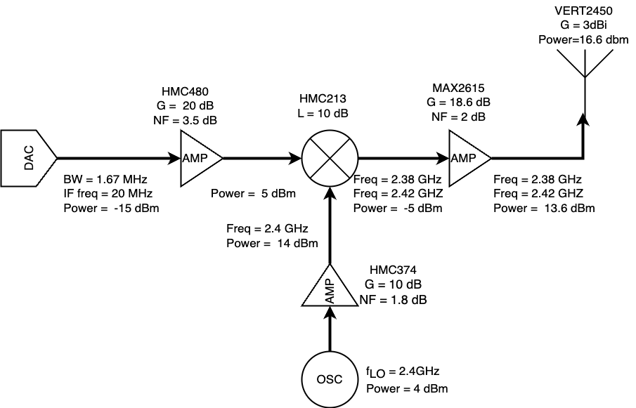
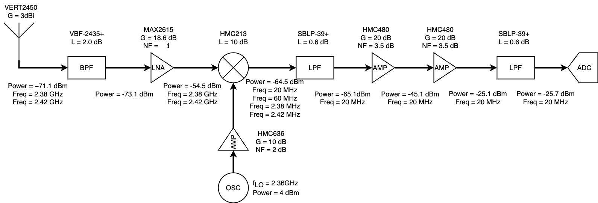

# MCC125-Wireless-link-project

## 1 Introduction
This is a course project,we need to demonstrate a simplex transmission of data (text, or picture or other file of your choice) over a distance of 100 m using your own designed and assembled hardware. You will construct and use your own software to modulate the carrier in the transmitter, to detect your message in the receiver and to correct the hardware impairments such as frequency offset, phase offset, timing synchronization, etc. To successfully complete the course on time, you will need to meet a certain deadlines, as for example submitting your PCB designs.

## 2 System Design

### 2.1 Transmitter

### 2.2 Receiver

